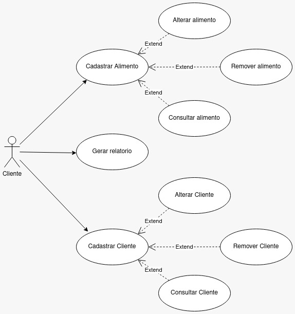
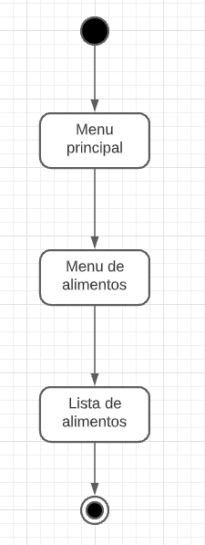

# TriEats
**Integrantes**

- Marcos Rodrigo Kalb Filho

- Enzo Bonfante 
- - - 

## Diagrama de caso de uso 

- - -
# Diagrama de atividade

- - -
## Funções do Software

| Caso de uso  | Descrição |
| -----------  | --------- |
| Cadastrar cliente | O programa pede para o admin fornecer os dados do cliente, afim de realizar seu cadastro. |
| Alterar cliente | Como os dados do cliente foram salvos, o admin tem a opção de alterar seus dados quando necessitado. |
| Deletar cliente | Ao ter pelo menos um cliente, a opção de remover cliente é disponibilizada. |
| Listar clientes | O programa mostra ao admin todos os clientes cadastrados . |
| Salvar clientes | Os clientes são salvos no arquivo. |
| Cadastrar Alimento | O programa pede para o admin fornecer os dados do alimento para seu cadastro. |
| Alterar alimento | Caso necessário, o admin tem a opção de alterar os dados do alimento. |
| Deletar alimento | Ao ter pelo menos um alimento, a opção de remover alimento é disponibilizada. |
| Listar alimento | O programa mostra ao admin todos os alimentos cadastrados . |
| Salvar alimentos | Os alimentos são salvos no arquivo.  |
| Sair | O programa é encerrado.   |

---
## Descrição do Caso de uso

- Objetivo: Remover um alimento do cadastro.
- Requisitos: Ter pelo menos um alimento cadastrado.
- Atores: Admin
- Pre-condições: Ter um alimento para remover. 
- Fluxo principal: 
    1. O menu geral é mostrado ao admin; 
    2. seleciona o menu de alimentos; 
    3. Ele cadastra os dados para o alimento; 
    4. Ele retorna para o menu geral; 
    5. Seleciona o menu de alimentos; 
    6. Exclui os dados do alimento; 
    7. É encerrado o caso de uso.
- Fluxo de Exceção
    1. O menu geral é mostrado ao admin; 
    2. Seleciona o menu de alimentos; 
    3. Ele seleciona a opção de excluir alimentos; 
    4. Não possuí alimentos listados, é mostrado a mensagem “Não foi listado nenhum alimento, digite os dados de pelo menos um alimento para poder acessar essa opção”.
- Extensões: Remover alimento com cadastrar alimento.
- Pos-condição: O alimento foi excluído. 
